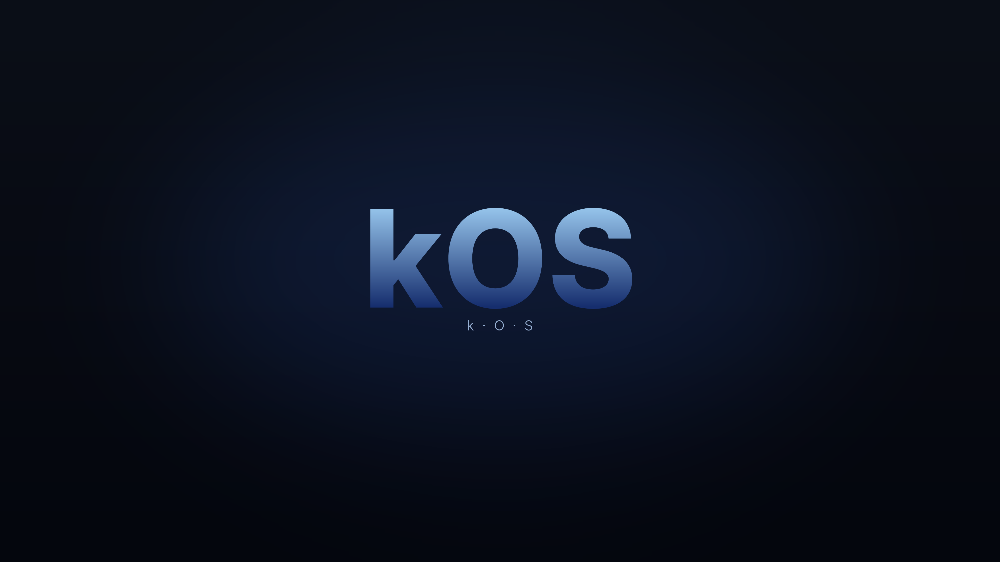

# kOS

A custom Linux distribution built on **Kali** with **KDE Plasma** — made to run *your* stuff and look clean doing it.

> ⚠️ kOS is a personal project, built for fun and learning. It's based on Kali, so it ships security tools — use them only on systems you own or have permission to test.

## What it does
- 🪟 **Runs Windows apps** — via Wine, your `.exe` files just work
- 🍎 **Plays nice with Apple** — opens iPhone photos (HEIC) and Mac files out of the box
- 🛡️ **Security toolkit built in** — the full Kali tool set (nmap, Wireshark, Burp, Ghidra, and more)
- 🔔 **Broadcast system** — a built-in message-of-the-day and update notifications I can push to every kOS machine ([how it works](https://github.com/KaiDevious/kos-motd-notif-sender))
- 🎨 **Custom look** — dark *and* light themes, custom wallpaper, boot splash, login screen, and terminal logo
- ⚡ **Quality-of-life tweaks** — no annoying system beep, reliable auto-networking, colored terminal

## Screenshots
| Dark | Light |
|------|-------|
|  |  |

## Install
**Easiest:** grab `kOS.iso` from the [Releases](https://github.com/KaiDevious/kOS/releases) page and install it in a VM or on real hardware.

**Build it yourself:** install Kali with KDE, then:
```bash
git clone https://github.com/KaiDevious/kOS
cd kOS && sudo bash scripts/kos-setup.sh
```
Reboot, then set the wallpaper, pick a Breeze Dark/Light global theme, and set the accent color.

## Repo layout
```
branding/   wallpapers, logos, boot splash, login screen, terminal logo
scripts/    kos-setup.sh — applies the whole kOS look + tweaks
docs/        build notes
```

## Credits
Built by **Kai**. Based on [Kali Linux](https://www.kali.org/) and [KDE Plasma](https://kde.org/). ISO built with [penguins-eggs](https://penguins-eggs.net/).

## License
Original kOS code, scripts, and configs: **GPL-3.0** (see [`LICENSE`](LICENSE)). Bundled software keeps its own licenses. The **kOS name and logo** are not covered — please don't ship a modified build as "kOS."
